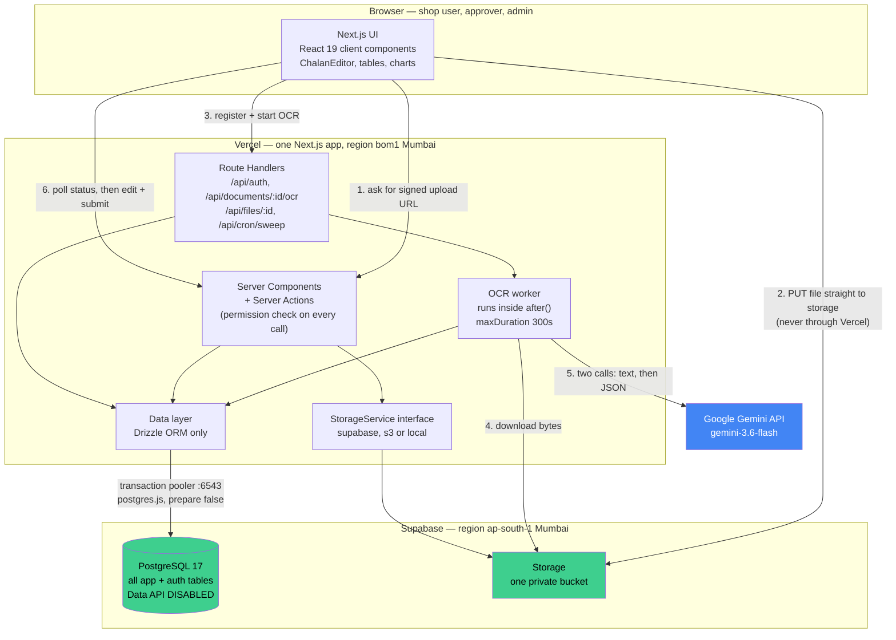
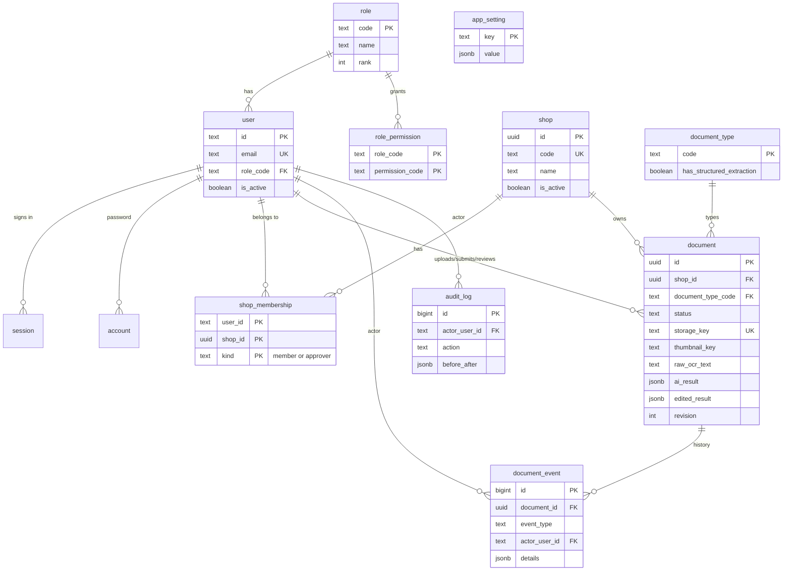
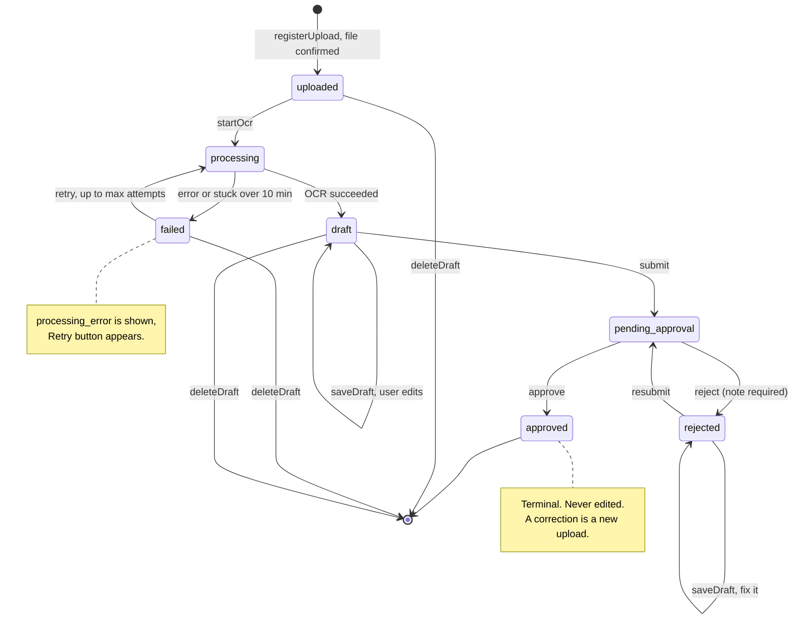

# Agora Dashboard — Build Plan

**Status:** planning only. No app code, no migrations, no cloud resources created yet.
**Written:** 2026-09-16. **Author:** Claude (architecture), for Alif.
**Read this file before starting any phase. Tick the checkboxes in section 17 as work lands.**

> ⚠️ **Twelve questions in section 2 are still unanswered.** Everything below assumes the
> recommended default for each one. Where an answer would change real work, the assumption is
> marked **[ASSUMED]**. Confirm or correct them before Phase 1 starts.

---

## 1. Scope

### Goal
A web dashboard for **Agora**, a company with many shop branches in Bangladesh. Shop staff upload
business documents (delivery chalans and receipts). An already-approved OCR agent reads them with
Google Gemini. Staff check and correct the extracted data, submit it, and an approver approves or
rejects it. Managers see counts, charts and lists.

### In scope
- Master Control (system-wide settings for the super admin).
- Shop setup, approver setup, users, and simple role-based access.
- File upload straight to storage, server-side OCR, structured editing, submit.
- Approval and rejection with a note, and full history of who did what and when.
- Dashboard: totals, per-shop counts with document images, pending list, approved list.
- A clean, modern, responsive UI with dark mode, in one visual language with the OCR app.

### Out of scope (v1)
- New structured document types. Only **delivery chalan** gets structured extraction. Everything
  else stores raw OCR text only. The data model allows more types later without a schema change.
- Changing the approved OCR logic: prompts, model settings, JSON shape, extraction behaviour.
- Bangla UI translation (the **data** is Bangla; the **interface** is English). See Q7.
- Mobile apps, offline mode, bulk import, ERP integration, e-mail/SMS notifications.
- Multi-level approval chains, delegation, out-of-office rules.
- Editing a document after it has been approved.

### Success criteria
1. A shop user uploads a chalan and gets correct structured data back, matching the old app.
2. An approver approves it, and the history shows every step.
3. Moving the database to a self-hosted Postgres needs env var changes only, no code changes.
4. No secret, cloud ID, or client document is ever committed to the public repo.

---

## 2. Open questions, and the assumptions used until they are answered

Answer these in one go. I will then correct this section and the rest of the plan.

### Q1. Master Control — what belongs in it?
**[ASSUMED] Recommended contents**, stored as one `app_setting` row per key, each validated by a
Zod schema in code:

| Group | Keys | Default |
|---|---|---|
| Company | `company.name`, `company.address`, `company.phone`, `company.logo_key` | Agora, blank |
| Uploads | `upload.allowed_mime_types`, `upload.max_file_bytes`, `upload.max_pdf_pages` | jpeg/png/webp/pdf, 20 MB, 20 pages |
| Approval | `approval.disallow_self_approval`, `approval.require_note_on_reject`, `approval.require_note_on_approve` | true, true, false |
| OCR | `ocr.default_model`, `ocr.max_attempts`, `ocr.stage_timeout_ms` | `gemini-3.6-flash`, 3, 120000 |
| Cost | `cost.pricing` (per model: USD per 1M input/output tokens), `cost.usd_to_bdt` | see section 3.6 | 
| Display | `display.timezone`, `display.currency`, `display.thumbnail_max_px` | Asia/Dhaka, BDT, 480 |

Only the **Super Admin** can change these. Every change is written to `audit_log` with the old and
new value. The default Gemini model is set here by the admin, not per user — as you suggested.

### Q2. Roles — final list and what each can do?
**[ASSUMED]** Five roles, exactly as you suggested: Super Admin, Admin, Approver, Shop User, Viewer.
The **permission vocabulary is fixed in code**; the **role → permission mapping lives in the
database** and is edited through a checkbox grid in Master Control. Super Admin bypasses the grid in
code, so nobody can lock themselves out. Full matrix in section 7.

One sub-question inside this: **may an Approver also upload?** Default **no** — an approver reviews
only. If one person must do both at a small branch, either give them Shop User and appoint a second
approver, or tick `document.upload` for Approver in the grid.

### Q3. Approval flow — how many levels? Resubmit after reject? Do raw-OCR documents need approval?
**[ASSUMED]**
- **One level.** One approval decides the document. No chains, no second sign-off.
- **Yes, a rejected document can be edited and sent again.** It keeps the same id, the same file and
  the same history. Every submission is snapshotted in the history so you can see what changed.
- **Yes, raw-OCR (non-chalan) documents also go through approval.** They follow the identical
  lifecycle; only the editor screen differs (a text area instead of the chalan form). This keeps one
  set of rules and one set of queries.
- Approving your own submission is **blocked by default**, switchable in Master Control (Q11).

### Q4. Uploads — only shop staff? Can a user belong to several shops?
**[ASSUMED]** Shop Users upload; Admins and Super Admins can upload too (useful for support and
testing). **Yes, one user can belong to several shops**, and an approver can be assigned to several
shops. One user has exactly **one role** across the whole system, and a list of shops it applies to.

### Q5. Login — which method, and who creates accounts?
**[ASSUMED]** **E-mail and password only**, using Better Auth with our own tables. **No public
sign-up.** An Admin or Super Admin creates the account and sets a temporary password; the user is
forced to change it on first login. Password reset is by e-mail link — which needs an e-mail sender
(Resend or SMTP). **Sub-question: which e-mail service, and do you have a domain for it?** Until
that is answered, Phase 2 ships admin-set passwords with no self-service reset.

### Q6. Volume — how many shops, users, documents per day? How long do we keep images?
**[ASSUMED]** Tens of shops, low hundreds of users, **up to ~200 documents per day (~4,000/month)**,
and **images kept forever**. These numbers drive the plan choices in section 15 and the cost
estimate in section 3.6. If the real number is much larger, the Supabase Free plan (1 GB of files)
lasts only weeks and the plan needs revisiting.

### Q7. UI language — English only, or English and Bangla?
**[ASSUMED]** **English interface**, with Bangla **data** rendering correctly everywhere (Hind
Siliguri font on every field that can hold Bangla). A full Bangla interface is a later phase; the
code will keep user-facing strings in one place so it stays possible.

### Q8. Branding — Agora's logo and brand colours?
**[ASSUMED]** Until you send the logo and colour codes, the UI reuses the approved OCR app's palette
exactly: slate greys, blue-600 as the brand accent, indigo-600 for primary actions, emerald for
export, and Inter + Hind Siliguri fonts. See section 10. **Please send: the logo as SVG or a
high-resolution PNG, plus the primary and secondary brand colours as hex codes.**

### Q9. Hosting — which Supabase org, region and plan? Which Vercel team and region?
**[ASSUMED]**
- Supabase: your only org, named **alifarman** (currently on the **Free** plan). Region
  **Mumbai (ap-south-1)** — closest to Bangladesh, and your other active project is already there.
- Vercel: your only team (currently **Hobby**). Function region **Mumbai (bom1)** to match.
- **⚠️ Two problems you must decide on, see section 19 R1 and R2:** Vercel's terms forbid commercial
  work on the Hobby plan, and the Supabase Free plan pauses a project after ~7 days of no database
  traffic, gives only 500 MB of database and 1 GB of files, and has no daily backups.
  **Recommendation: Vercel Pro ($20/month) and Supabase Pro ($25/month) before real client use.**

### Q10. GitHub repo — which name?
**Answered by inspection, no action needed.** `origin` already points at
`https://github.com/alifarman007/agora-chalan-ocr-with-shop-and-admin`, it is **public**, its default
branch is `main`, and it has **no commits yet**. A Vercel project of the same name already exists and
is linked to it (see section 20).

### Q11. Confirm the self-approval rule
**[ASSUMED] Yes** — a user cannot approve a document they submitted, by default, for every role
including Super Admin. It is a switch in Master Control for small branches where one person does
everything. The rule binds to the **last submitter**, not the uploader, because submitting is the act
that says "this data is correct".

### Q12. Four decisions inside the OCR port that change what the user sees
These come out of studying the approved agent (section 3). Each needs a yes or no.

| # | Question | Recommended |
|---|---|---|
| a | The old app shows "Step 1/2: Extracting Text" then "Step 2/2: Structuring Data". Server-side, the browser cannot see that switch unless it polls. Keep the two steps by polling a status field, or collapse to one "Processing" state? | **Keep two steps by polling.** Same wording as approved. |
| b | The cost panel uses $0.10/$0.40 per million tokens. Google's real list price for this model today is **$0.75/$3.75**, rising to $1.50/$7.50 on 2027-01-01. Fix the rates? | **Yes, fix them** and move the table into Master Control so it can be updated without a deploy. This is a display estimate, not approved OCR logic. |
| c | `ModelType` still lists `gemini-3-pro-preview` (Google **shut this down** on 2026-03-09) and `gemini-2.5-flash-latest` (not on Google's model list at all). Remove the dead entries? | **Yes, remove both.** The active model `gemini-3.6-flash` is unaffected and stays. |
| d | The line-items table uses the browser's `prompt()` and `confirm()` pop-ups for adding and deleting columns. Replace with proper in-app dialogs? | **Yes** — same behaviour, better look, and it fixes a real usability problem on mobile. |

---

## 3. OCR repo findings

### 3.1 What was studied
| Item | Value |
|---|---|
| Local path | `C:\Python_Projects\agoraOCR` (read-only; never modified) |
| GitHub | https://github.com/alifarman007/agoraOCR (public) |
| Approved commit | **`b54ac32046e14fa791457a391f4d67ccc69aa2ce`** — "four api", 2026-08-11 |
| Local vs GitHub | **Identical.** `git ls-remote` HEAD matches the local HEAD. Working tree clean. |
| Size | 31 tracked files, ~2,000 lines of TypeScript |
| Secrets check | No API-key-shaped strings in any tracked file or in the local build output. `.env.local` is ignored and was never opened. |

### 3.2 How it works
React 19 + Vite, browser only, no backend and no database. One pipeline:

```
image or PDF → base64 → Gemini call 1 (performOCR)      → layout-preserving raw text
                      → Gemini call 2 (structureChalan) → JSON (responseMimeType: application/json)
                      → strip ``` fences → JSON.parse → add ids, processed_at, raw_ocr_text, usage
                      → DeliveryChalanDocument → ChalanEditor → export JSON or Excel
```

Key facts that constrain the port:
- **Both calls use one model**, `gemini-3.6-flash`, hard-coded in `StructuredEditorTab.tsx`, at
  `temperature: 0.1`. Call 2 sets `responseMimeType: "application/json"`.
- **Call 2 never sees the image.** It only receives the text from call 1. Quality is capped by the
  OCR step. This is approved behaviour and must be preserved.
- Every Gemini call goes through `withGeminiFailover()`, which rotates a pool of up to four API keys
  on any API error and remembers which key last worked.
- The model name is deliberately never shown in the UI, but is recorded in the exported JSON.
- Confidence badges: green at ≥ 0.9, yellow "Review" at ≥ 0.7, red "Low Conf." below. Values above 1
  are treated as percentages. In the line-items table the badge is hidden when confidence ≥ 0.9.

### 3.3 What we reuse unchanged
| From the agent | Used as |
|---|---|
| `services/geminiClient.ts` | The key pool and failover, moved to server-only |
| `services/geminiService.ts` | `performOCR()` — OCR prompt is approved logic |
| `services/structureService.ts` | `structureDeliveryChalan()` — chalan prompt and hydration are approved logic |
| `types/delivery-chalan.ts` | The whole domain model, including `SubmitChalanRequest` / `SubmitChalanResponse` |
| `types.ts` | `ModelType`, `UsageMetadata`, `OCRResult`, `CostEstimate` |
| `utils/costCalculator.ts` | Cost maths (rates move to settings — Q12b) |
| `utils/excelGenerator.ts` | The whole Excel layout, which is an approved export format |
| `components/StructuredEditor/*` | ChalanEditor and all its sections, confidence badges, submit panel |
| `components/AnalyticsPanel.tsx` | Token and cost panel |
| `index.html` head | Fonts, `.bangla-text` class, custom scrollbar CSS |

### 3.4 Every planned change to the agent code

**Group A — plumbing only. Approved logic untouched.**

| # | File | Change | Why |
|---|---|---|---|
| A1 | `services/geminiClient.ts` | Add `import 'server-only'` as line 1. Delete the Vite-`define` comment block. Keep key names `GEMINI_API_KEY_1..4` and the legacy `GEMINI_API_KEY`. | The key must never reach the browser. Next reads non-`NEXT_PUBLIC_` env at runtime on the server. |
| A2 | `services/geminiService.ts` | Add `import 'server-only'`. Nothing else. | Same. |
| A3 | `services/structureService.ts` | Add `import 'server-only'`. Nothing else. | Same. |
| A4 | `StructuredEditorTab.tsx` | Split. The file picker, preview and progress UI stay in a client component. The pipeline body (`performOCR` → `structureDeliveryChalan` → assign `ocr_usage`) moves **verbatim** into a server module that reads bytes from storage instead of a browser `FileReader`. | The Gemini key must be server-side, and Vercel refuses request bodies over 4.5 MB. |
| A5 | `ChalanEditor.tsx` + its 7 sections + `ConfidenceBadge` | Add `'use client'`. `imageUrl` becomes a short-lived signed storage URL instead of a `data:` URL. | They use `useState` and browser APIs. |
| A6 | `SubmitPanel.tsx` | Add `'use client'`. Keep Copy JSON, Download JSON, Export Excel byte-identical. Add a **Submit for approval** button next to them. | The three exports are approved; submit is the new dashboard feature. |
| A7 | `utils/excelGenerator.ts` | Keep client-side. Optionally load it with `next/dynamic` so ExcelJS stays out of the first page load. Drop `file-saver`, use `URL.createObjectURL` instead. | Same output file, smaller bundle, one less dependency. |
| A8 | `AnalyticsPanel.tsx` | Add `'use client'`. Pass a fixed `'en-US'` locale to every `toLocaleString()`. | Otherwise server and browser can format numbers differently and React warns about a hydration mismatch. |
| A9 | `index.html`, `index.tsx`, `App.tsx`, `vite.config.ts` | Replaced by `app/layout.tsx` + route pages. Fonts move to `next/font/google`. Carry the `.bangla-text` rule and the scrollbar CSS into `globals.css` with the **same hex values**. Drop the Tailwind CDN script, the esm.sh import map and the dead `/index.css` link. | Next.js has its own shell. The CDN and import map are not production-safe. |
| A10 | `types.ts` | `FileData` references the DOM `File` type — move it into the client upload component. | It cannot exist in a server module. |
| A11 | `components/ModelSelector.tsx`, `metadata.json`, `migrated_prompt_history/` | **Do not port.** Dead code and AI Studio leftovers. | Nothing imports them. |
| A12 | New: `.gitattributes` with `* text=auto eol=lf` | Forces LF line endings. | Your machine has `core.autocrlf=true`. A CRLF checkout would silently change the prompt text from 1,138 to 1,151 bytes and alter every Gemini request. |

**Group B — needs your approval (Q12).** Two-step progress via polling, the cost rate table, removing
the two dead model IDs, and replacing `prompt()`/`confirm()` with dialogs.

**Group C — new server-side guards that can only reject input, never change output.**
MIME allowlist, byte cap, PDF page cap, and lenient shape validation of the model's JSON (log a
warning, only reject when the editor would actually crash). This keeps behaviour a superset of the
approved app.

### 3.5 Approved-logic fingerprints (a test will assert these)
| Thing | Value |
|---|---|
| OCR system prompt | 1,138 bytes, SHA-256 `a56c92ab33ec109b4a4a01ad9879f548a0b1c3a58bd30a34af9651597083300e` |
| Chalan structure prompt | 3,465 bytes UTF-8, SHA-256 `4558824e505230abd85dd664f23cadf0726d76e3d2189e39699c35daf0be76c2` |
| OCR user text | 92 chars, "Perform OCR on this document. Preserve layout and Bangla/English text exactly as it appears." |
| Model | `gemini-3.6-flash` for both calls |
| Config call 1 | `{ systemInstruction, temperature: 0.1 }` |
| Config call 2 | `{ systemInstruction, temperature: 0.1, responseMimeType: "application/json" }` |
| SDK | `@google/genai` — locked at **1.44.0** in the approved app (package.json says `^1.39.0`) |

If any of these change, the port has drifted. A unit test asserts the two hashes on every run.

### 3.6 Model and cost facts checked against Google's live docs (2026-09-16)
| Model ID in the code | Status today |
|---|---|
| `gemini-3.6-flash` | **Valid, GA since 2026-07-21, no shutdown date.** Keep it. |
| `gemini-3-flash-preview` | Valid but Preview; Google names 3.6-flash as its successor. |
| `gemini-3-pro-preview` | **Shut down 2026-03-09. Requests fail.** Remove (Q12c). |
| `gemini-2.5-flash-latest` | **Not listed anywhere in Google's docs.** Remove (Q12c). |

- Real price for `gemini-3.6-flash`: **$0.75 per 1M input tokens, $3.75 per 1M output**, through
  2026-12-31, then **$1.50 / $7.50**. The app's table says $0.10 / $0.40 — roughly 8× too low.
- Thinking is on by default for Gemini 3 models and **thinking tokens are billed as output**. The
  SDK also reports `thoughtsTokenCount`, which the old app ignores. We will store it.
- Rough cost per chalan at today's prices: **about $0.007–0.01** (≈ ৳1.0–1.3). At 4,000 documents a
  month that is **about $30/month**, doubling in January 2027.
- Inline file data caps the **whole request** at 20 MB, and base64 inflates bytes by a third, so the
  practical original-file ceiling is about 14 MB. PDFs: Gemini accepts up to 50 MB / 1,000 pages.
- **Key rotation no longer buys quota.** Google applies rate limits **per project, not per key**. The
  four-key pool only helped because the keys came from different free projects. On one paid project,
  keep the pool code (it is approved and harmless) but rely on a single paid key plus retry.

### 3.7 Risks found inside the approved agent
1. **The four Gemini keys were shipped inside browser bundles.** Anyone who opened the deployed old
   app could read them. **Rotate all four before launch.**
2. The old app pins nothing: Tailwind comes from a CDN and React/Gemini/lucide come from esm.sh with
   caret ranges. What the client approved may already have drifted. Treat the lockfile versions as
   the baseline and pin exactly.
3. Ids inside the document JSON come from `Math.random()`, not UUIDs. They are part of the approved
   export format, so **do not change them**. The database row gets its own separate UUID.
4. No MIME validation, no size limit, no PDF page limit. PDFs are sent inline with no checks, and the
   PDF preview is broken (`` pointing at a PDF renders nothing).
5. No schema validation of the model's JSON. A malformed response can crash the editor.

---

## 4. Architecture



### Key decisions

| # | Decision | Choice | Why | Alternatives rejected |
|---|---|---|---|---|
| D1 | Framework | Next.js 16 App Router, one app, TypeScript | Server code keeps the database and the Gemini key off the browser. One app means one deploy, one auth session, one build. | Monorepo (no second consumer yet); separate API service (more to run, no benefit at this size) |
| D2 | Database access | **Drizzle ORM only**, through one `src/db` layer | Works on any Postgres. Migrations are files in this repo. Nothing Supabase-specific leaks into queries. | `supabase-js` / PostgREST (locks us in); Prisma (heavier, its own engine); raw SQL (no type safety) |
| D3 | Auth | **Better Auth** with our own `user/session/account/verification` tables | Sessions live in our Postgres and travel with a `pg_dump`. No Supabase Auth to unpick later. | Supabase Auth (data lives in a schema we cannot move); NextAuth (session storage is less portable); rolling our own (security risk) |
| D4 | Permission model | Permission **codes fixed in code**, role→permission **mapping in the database**, Super Admin bypasses in code | You asked for a checkbox grid. Code-side codes mean a permission the UI shows is always one the server enforces. The bypass means nobody can lock themselves out. | All-in-code (no grid, needs a deploy); all-in-DB (the grid could invent permissions nothing checks) |
| D5 | File upload | Browser → **signed upload URL** → storage directly | Vercel rejects any request body over 4.5 MB, and Server Actions default to 1 MB. File bytes never touch a function. | Upload through the server (breaks on any real scan); base64 in a form (worse) |
| D6 | Storage | Small `StorageService` interface; Supabase driver now | One interface, three future drivers (S3, MinIO, local disk). Only object keys are stored in the database, so a move is an `rclone` copy plus env vars. | Calling Supabase Storage directly from feature code (would need rewriting later) |
| D7 | Long OCR | Route handler returns **202 immediately**, work runs in Next's `after()` with `maxDuration = 300`, browser polls a status field | Simple, no queue, no extra vendor, and the same function runs unchanged on a self-hosted box. Two Gemini calls take 30–120 s, well inside 300 s. | Vercel Queues (Beta); Vercel Workflows (extra dependency, state pinned outside our region on the stable line); external queue (another vendor and another cloud ID) |
| D8 | Stuck jobs | Lazy reaper: any row `processing` for over 10 minutes is marked `failed` by the next status poll or list query, plus a **daily** cron as a backstop | Hobby only allows **daily** crons, so the reaper cannot depend on cron alone. A visible "failed, click retry" beats an invisible stuck job. | Per-minute cron (needs Pro); a job table with leases (a second source of truth for the same status) |
| D9 | Document history | One append-only `document_event` table. Every submit stores a **full snapshot** of the submitted data. | Gives "who did what, when, with what note" and lets an approver see what changed between submissions — without a separate versions table and a second write path. | A `document_version` table (doubles write paths for a diff feature nobody asked for); no history (fails the audit requirement) |
| D10 | Structured data storage | Two `jsonb` columns: `ai_result` (never modified) and `edited_result` (the user's copy). A few values are copied out into normal columns for sorting. | The approved `DeliveryChalanDocument` is stored exactly as produced. A new document type later needs a seed row and a code module, **not a migration**. | Relational line-item tables (would flatten and alter approved output, and break on a new type) |
| D11 | Postgres types | `uuid` via `gen_random_uuid()`, `timestamptz`, `jsonb`, `text` + `CHECK` for enums, `numeric` for money | All core Postgres 13+. No extension needed. `text`+`CHECK` avoids the `ALTER TYPE` pain that Postgres enums cause in migrations. | Postgres `ENUM` types (awkward to change); `serial` (identity is the modern form); storing local times (confuses auditors) |
| D12 | Data API | **Disable Supabase's Data API entirely** (see section 14) | With it off, no auto-generated REST endpoint answers at all, whatever the grants or policies say. It is one switch, and it needs no RLS policies — which we are not allowed to base on `auth.uid()` anyway. | RLS with no policies (blocks the anon key but **not** the service-role key, which bypasses RLS); removing `public` from exposed schemas (works, but the Data API stays on) |
| D13 | Thumbnails | Images: server-side with `sharp` inside the OCR job. PDFs: page 1 rendered **in the browser** and uploaded alongside the original. | The upload page already needs pdf.js for the preview. Doing PDFs server-side would add ~70 MB of native binaries to the function and slow every cold start. | All server-side (bundle weight); all browser-side (untrusted for images we can do properly); no thumbnails (lists would load full scans) |
| D14 | TypeScript version | **5.9.3**, not 7.x | TypeScript 7 removed the JavaScript compiler API. `typescript-eslint` (pulled in by `eslint-config-next`) caps TypeScript below 6.1, and Next's TS 7 path is an experimental flag with weaker error messages. | TS 7.0.2 (latest, but breaks linting today); TS 6.0.3 (works, but less tool support than 5.9) |
| D15 | Gemini SDK version | Pin **1.44.0** through the parity test, then upgrade to 2.x as a separate, re-tested step | 1.44.0 is what the client approved. Google states the 2.0 breaking changes are confined to a different API, but "states" is not "tested". | Start on 2.22.0 (risks an unexplained difference during parity testing); stay on 1.x forever (1.x stopped getting releases in May 2026) |

---

## 5. Tech stack

All versions checked against the npm registry on **2026-09-16**. Pin them exactly in `package.json`.

| Area | Package | Version | Note |
|---|---|---|---|
| Runtime | Node.js | **24.x** | Set `engines.node`. Vercel's default. Node 20 is deprecated on Vercel from 2026-10-01. |
| Framework | `next` | **16.3.5** | App Router. `middleware.ts` is now `proxy.ts`. `next lint` is gone. Turbopack is the default. |
| UI | `react`, `react-dom` | **19.3.0** | |
| Language | `typescript` | **5.9.3** | See D14. Not 7.x. |
| Styling | `tailwindcss`, `@tailwindcss/postcss` | **4.3.3** | v4. The old app used the v3 CDN — see section 10 for the visual check list. |
| Components | `shadcn` (CLI) | **4.21.0** | Run via `npx`, not a dependency. Pick Radix or Base UI once — see Phase 4. |
| Animation | `tw-animate-css` | **1.4.0** | Replaces the deprecated `tailwindcss-animate`. |
| Icons | `lucide-react` | **1.46.0** | All 29 icons the old app uses still exist. Seven are now aliases; use canonical names in new code. |
| Charts | `recharts` | **3.10.1** | Client components only. |
| Tables | `@tanstack/react-table` | **9.2.4** | v9 is stable GA. API changed from v8 (`useTable`, not `useReactTable`) — follow shadcn's current guide, not old blog posts. |
| ORM | `drizzle-orm` | **0.45.2** | |
| Migrations | `drizzle-kit` | **0.31.10** | `generate` then `migrate`. |
| PG driver | `postgres` (postgres.js) | **3.4.9** | Must use `{ prepare: false }` through the transaction pooler. |
| Auth | `better-auth` | **1.7.5** | |
| Auth adapter | `@better-auth/drizzle-adapter` | **1.7.5** | Now a separate package. |
| AI | `@google/genai` | **1.44.0** → 2.22.0 later | See D15. |
| Validation | `zod` | **4.6.5** | |
| Images | `sharp` | **0.35.4** | Prebuilt Linux binary; Next already depends on it. |
| PDF | `pdfjs-dist` | **6.3.289** | Browser use only in v1 (preview + thumbnail). |
| Excel | `exceljs` | **4.4.0** | Unmaintained since 2024. Keep it behind one small module so it can be swapped. |
| Dates | `date-fns` + `@date-fns/tz` | **4.4.0** / **1.5.0** | For Dhaka day boundaries in reports. Plain `Intl` is enough for display. |
| Theme | `next-themes` | **0.4.6** | Dark mode. |
| Toasts | `sonner` | **2.0.8** | |
| Lint | `eslint` + `eslint-config-next` | **10.10.0** / **16.3.5** | Flat config only. `npm run lint` runs `eslint .`. |
| Unit tests | `vitest` | **5.0.1** | Needs Vite 8 as a peer. |
| E2E tests | `@playwright/test` | **1.63.0** | |

**Things to remember from the version check:**
- `next build` no longer lints. Lint is a separate script.
- `cookies()`, `headers()`, `params` and `searchParams` are all async in Next 16.
- Server Functions are POSTs to the page route, so a `proxy.ts` matcher that skips a path also skips
  it for Server Actions. **Always re-check permissions inside every action.**
- Leave `cacheComponents` off. This dashboard is nearly all per-user dynamic data.

---

## 6. Data model

**13 tables.** All in the `public` schema. All standard Postgres. Better Auth owns four of them.



### 6.1 Better Auth tables (generated by `npx auth generate`, then owned by our migrations)

**`user`** — Better Auth owns `id` (text), `name`, `email`, `email_verified`, `image`,
`created_at`, `updated_at`. **We add:**

| Column | Type | Notes |
|---|---|---|
| `role_code` | `text not null default 'shop_user'` | FK → `role.code` `ON DELETE RESTRICT` |
| `is_active` | `boolean not null default true` | Inactive users are refused at session check and their sessions are revoked |
| `phone` | `text null` | Display only |
| `must_change_password` | `boolean not null default true` | Forces a password change after an admin creates the account |
| `created_by_user_id` | `text null` | FK → `user.id` `ON DELETE SET NULL` |

Indexes: PK `(id)`, unique index on `lower(email)`, index on `(role_code)`.

**`session`**, **`account`**, **`verification`** — exactly as Better Auth generates them. `account`
holds the hashed password. Indexes: unique `session.token`, index `session.user_id`, unique
`account(provider_id, account_id)`, index `verification.identifier`.

> ⚠️ Do **not** set Better Auth's `schemaName: "auth"`. Supabase already owns a managed `auth`
> schema. Our tables stay in `public`, which is also what makes them travel in a plain `pg_dump`.

### 6.2 Roles and permissions

**`role`** — 5 seeded rows, never edited at runtime.

| Column | Type | Notes |
|---|---|---|
| `code` | `text PK` | `CHECK` in `('super_admin','admin','approver','shop_user','viewer')` |
| `name` | `text not null` | "Super Admin", "Shop User", … |
| `description` | `text null` | |
| `rank` | `int not null` | 100/80/60/40/20. An admin may only assign a role with a rank **below** their own. |

**`role_permission`** — the checkbox grid. Seeded with the defaults in section 7.

| Column | Type | Notes |
|---|---|---|
| `role_code` | `text` | FK → `role.code` `ON DELETE CASCADE` |
| `permission_code` | `text` | Validated in code against the fixed `PERMISSIONS` list |
| `granted_by_user_id` | `text null` | FK → `user.id` |
| `granted_at` | `timestamptz not null default now()` | |

PK `(role_code, permission_code)`. Rows for `super_admin` are **ignored at runtime** — code grants it
everything. Every grid save writes a row to `audit_log` with the before and after sets.

### 6.3 Shops and access

**`shop`**

| Column | Type | Notes |
|---|---|---|
| `id` | `uuid PK default gen_random_uuid()` | |
| `code` | `text not null UNIQUE` | Short human code, e.g. `DHK-GUL-01`. Immutable after creation. |
| `name`, `address`, `phone` | `text` | `name` not null |
| `is_active` | `boolean not null default true` | Inactive shops disappear from the upload picker but keep their documents |
| `created_by_user_id` | `text null` | FK → `user.id` |
| `created_at`, `updated_at` | `timestamptz not null default now()` | |

Indexes: PK, unique `(code)`, index `(is_active)`. **Shops are never deleted**, only deactivated, so
document foreign keys stay valid.

**`shop_membership`** — one table answers both "which shops can this user see?" and "who approves
shop X?".

| Column | Type | Notes |
|---|---|---|
| `user_id` | `text` | FK → `user.id` `ON DELETE CASCADE` |
| `shop_id` | `uuid` | FK → `shop.id` `ON DELETE CASCADE` |
| `kind` | `text` | `CHECK in ('member','approver')` |
| `created_by_user_id` | `text null` | FK → `user.id` |
| `created_at` | `timestamptz not null default now()` | |

PK `(user_id, shop_id, kind)`. Index on `(shop_id, kind)`. A person can be a `member` of shop A and
an `approver` of shop B. Admins and Super Admins have no rows at all — they get the
`shop.view_all` permission instead.

### 6.4 Configuration

**`app_setting`** — Master Control. One row per key, value as `jsonb`, each key validated by a Zod
schema in code so **adding a setting never needs a migration**.

| Column | Type |
|---|---|
| `key` | `text PK` |
| `value` | `jsonb not null` |
| `updated_by_user_id` | `text null` FK → `user.id` |
| `updated_at` | `timestamptz not null default now()` |

**`document_type`** — the registry that makes "more document types later" possible.

| Column | Type | Notes |
|---|---|---|
| `code` | `text PK` | Matches `DeliveryChalanDocument.document_type` |
| `name` | `text not null` | Display label |
| `has_structured_extraction` | `boolean not null default false` | `true` → run the second Gemini call and store `ai_result`. `false` → raw text only. |
| `is_active` | `boolean not null default true` | |
| `sort_order` | `int not null default 0` | |

Seeded with `delivery_chalan` (structured) and `receipt` (raw only).

**Adding a type later** = insert one row + add a module to a code-side extractor registry holding its
prompt and Zod schema. The `document` table is untouched, because the payload lives in `jsonb`.

### 6.5 The core table

**`document`** — one row per uploaded file, for its whole life.

| Column | Type | Notes |
|---|---|---|
| `id` | `uuid PK default gen_random_uuid()` | Generated by the server **before** upload so the storage key can embed it |
| `shop_id` | `uuid not null` | FK → `shop.id` `ON DELETE RESTRICT` |
| `document_type_code` | `text not null` | FK → `document_type.code` `ON DELETE RESTRICT` |
| `status` | `text not null default 'uploaded'` | `CHECK in ('uploaded','processing','failed','draft','pending_approval','approved','rejected')` |
| `original_filename` | `text not null` | As the browser reported it. Display only. |
| `mime_type` | `text not null` | |
| `file_size_bytes` | `bigint not null` | |
| `sha256` | `text not null` | Hex. Computed in the browser, re-verified server-side from the downloaded bytes. |
| `storage_key` | `text not null UNIQUE` | Bucket-relative |
| `thumbnail_key` | `text null` | Null until generated, or if generation failed |
| `raw_ocr_text` | `text null` | Gemini call 1. **Written as a checkpoint** before call 2, so a structuring failure never repays for OCR. `text`, not `jsonb`, so it can be searched with `ILIKE`. |
| `ai_result` | `jsonb null` | Gemini call 2 output, stored **exactly as returned**. Never modified after write. |
| `edited_result` | `jsonb null` | The user's working copy. Starts as a copy of `ai_result`. |
| `corrections_made` | `boolean null` | From `SubmitChalanRequest` |
| `correction_count` | `int null` | From `SubmitChalanRequest` |
| `ai_confidence` | `numeric(5,4) null` | Copied out of `ai_result` for sorting and filtering |
| `processing_model` | `text null` | The Gemini model actually used |
| `input_tokens`, `output_tokens`, `thinking_tokens` | `int null` | Both calls summed |
| `cost_usd` | `numeric(12,6) null` | Frozen at completion from the rate table in settings |
| `ocr_attempts` | `int not null default 0` | |
| `ocr_started_at`, `ocr_finished_at` | `timestamptz null` | `ocr_started_at` drives the stale reaper |
| `processing_error` | `text null` | Last error. Cleared on the next attempt. |
| `uploaded_by_user_id` | `text not null` | FK → `user.id` `ON DELETE RESTRICT` |
| `submitted_by_user_id` | `text null` | FK → `user.id`. **Drives the self-approval rule.** |
| `submitted_at` | `timestamptz null` | |
| `submission_count` | `int not null default 0` | 0 = never submitted, 2+ = resubmitted |
| `reviewed_by_user_id` | `text null` | FK → `user.id`. Last approve/reject actor. |
| `reviewed_at` | `timestamptz null` | |
| `review_note` | `text null` | Last approve/reject note |
| `revision` | `int not null default 0` | Optimistic lock. Bumped by every write. |
| `created_at`, `updated_at` | `timestamptz not null default now()` | |

**Indexes**
```
PRIMARY KEY (id)
UNIQUE (storage_key)
UNIQUE (shop_id, sha256)                                    -- blocks the same file twice in one shop
INDEX (shop_id, status, created_at DESC)                    -- every shop-scoped list
INDEX (status, created_at DESC)                             -- admin pending/approved lists, dashboard counts
INDEX (ocr_started_at) WHERE status = 'processing'          -- the stale reaper
INDEX (submitted_by_user_id)
INDEX (document_type_code)
```

**`document_event`** — append-only. Audit log, approval history and OCR attempt log in one table.

| Column | Type | Notes |
|---|---|---|
| `id` | `bigint generated always as identity PK` | Naturally ordered |
| `document_id` | `uuid not null` | FK → `document.id` `ON DELETE CASCADE` |
| `event_type` | `text not null` | `CHECK in ('uploaded','ocr_started','ocr_succeeded','ocr_failed','draft_saved','submitted','resubmitted','approved','rejected','deleted')` |
| `actor_user_id` | `text null` | FK → `user.id` `ON DELETE SET NULL`. Null = the system (OCR worker, reaper). |
| `from_status`, `to_status` | `text null` | |
| `note` | `text null` | The approver's note |
| `details` | `jsonb null` | Per-event payload. `ocr_*` → attempt, model, tokens, duration, error. `submitted`/`resubmitted` → **a full snapshot of `edited_result`** plus the correction count. |
| `request_id` | `uuid null` | Client-generated, for idempotency (section 8) |
| `created_at` | `timestamptz not null default now()` | |

Indexes: PK, `(document_id, created_at)`, `(event_type, created_at DESC)`, and a partial unique index
on `(document_id, request_id) WHERE request_id IS NOT NULL`.

**`audit_log`** — the same idea for everything that is *not* a document: shop changes, memberships,
user role changes, settings edits, permission-grid edits.

| Column | Type |
|---|---|
| `id` | `bigint generated always as identity PK` |
| `actor_user_id` | `text null` FK → `user.id` |
| `action` | `text not null` — e.g. `settings.update`, `role_permission.update`, `user.deactivate` |
| `target_type`, `target_id` | `text null` |
| `details` | `jsonb null` — before and after values |
| `created_at` | `timestamptz not null default now()` |

Index on `(created_at DESC)` and `(actor_user_id, created_at DESC)`.

---

## 7. Permissions

### 7.1 The fixed permission list (a TypeScript `const`, checked at compile time)

```
dashboard.view        document.upload       document.view         document.edit
document.submit       document.approve      document.retry_ocr    document.delete_draft
document.download     document.history.view shop.view_all         shop.manage
membership.manage     user.manage           role.manage           settings.manage
audit.view
```

`document.approve` covers both approving and rejecting — they are the same authority.
`shop.view_all` is how a role sees every shop, rather than hard-coding role names in queries.

### 7.2 The default matrix (seeded into `role_permission`, editable in Master Control)

| Permission | Super Admin | Admin | Approver | Shop User | Viewer |
|---|:--:|:--:|:--:|:--:|:--:|
| `dashboard.view` | ✅ | ✅ | ✅ | ✅ | ✅ |
| `document.upload` | ✅ | ✅ | ⬜ | ✅ | ⬜ |
| `document.view` | ✅ | ✅ | ✅ | ✅ | ✅ |
| `document.edit` | ✅ | ✅ | ⬜ | ✅ | ⬜ |
| `document.submit` | ✅ | ✅ | ⬜ | ✅ | ⬜ |
| `document.approve` | ✅ | ✅ | ✅ | ⬜ | ⬜ |
| `document.retry_ocr` | ✅ | ✅ | ⬜ | ✅ | ⬜ |
| `document.delete_draft` | ✅ | ✅ | ⬜ | ✅ | ⬜ |
| `document.download` | ✅ | ✅ | ✅ | ✅ | ✅ |
| `document.history.view` | ✅ | ✅ | ✅ | ✅ | ⬜ |
| `shop.view_all` | ✅ | ✅ | ⬜ | ⬜ | ⬜ |
| `shop.manage` | ✅ | ✅ | ⬜ | ⬜ | ⬜ |
| `membership.manage` | ✅ | ✅ | ⬜ | ⬜ | ⬜ |
| `user.manage` | ✅ | ✅ | ⬜ | ⬜ | ⬜ |
| `role.manage` | ✅ | ⬜ | ⬜ | ⬜ | ⬜ |
| `settings.manage` | ✅ | ⬜ | ⬜ | ⬜ | ⬜ |
| `audit.view` | ✅ | ✅ | ✅ | ⬜ | ⬜ |

**Master Control and the permission grid are Super Admin only.** Admins run the day-to-day system
but cannot change the rules of the system.

### 7.3 How shop-level access works

One function, used by everything:

```ts
resolveScope(session, purpose: 'read' | 'approve' | 'upload'): 'all' | string[]
```

- If the role has `shop.view_all` → `'all'`.
- `read` → every `shop_id` in `shop_membership` for this user, any `kind`.
- `approve` → only rows with `kind = 'approver'`.
- `upload` → only rows with `kind = 'member'`, and the shop must be active.
- An empty list short-circuits to an empty result — it never means "everything".

Rules that must hold, and that tests will enforce:
1. **Every** list or aggregate query goes through one helper that appends
   `AND shop_id = ANY($ids)` unless the scope is `'all'`. `scope` is a **required parameter**, so
   forgetting it is a compile error.
2. **Every** single-document action loads the row through `requireDocument(session, id, permission)`,
   which checks the permission, checks the shop is in scope, and returns the row. No action ever
   queries a document by id directly.
3. The client never supplies a shop id for authorisation, only for filtering.
4. Hiding a button is never the check. The server decides every time.
5. An inactive user fails at the session check and their sessions are revoked immediately.

### 7.4 The self-approval rule
`approveDocument` and `rejectDocument` refuse when
`document.submitted_by_user_id === session.user.id`, unless `approval.disallow_self_approval` is
turned off in Master Control. It applies to **every role, including Super Admin**, so there is one
sentence to explain and one switch to change. It is also enforced in the SQL `WHERE` clause, not only
in TypeScript, so a race cannot slip past it. The pending list still **shows** your own submissions,
with a disabled button reading "You submitted this — another approver must review it".

---

## 8. Document lifecycle



### Transitions in detail

| From → To | Trigger | Who | What is recorded |
|---|---|---|---|
| — → `uploaded` | `registerUpload` | `document.upload` in that shop | Row inserted; event `uploaded` with filename, size, sha256, mime |
| `uploaded` → `processing` | `startOcr` (fired automatically right after register) | `document.upload` | `ocr_attempts+1`, `ocr_started_at`, model; event `ocr_started` |
| `failed` → `processing` | Retry button | `document.retry_ocr`, under `ocr.max_attempts` unless admin | Same |
| `processing` → `draft` | OCR worker success | system | `raw_ocr_text`, `ai_result`, `edited_result` = copy, confidence, tokens, cost, thumbnail; event `ocr_succeeded` |
| `processing` → `failed` | Worker threw, or reaper found it stuck > 10 min | system | `processing_error`; event `ocr_failed` |
| `draft` → `draft` | `saveDraft` | `document.edit` | `edited_result`, `revision+1`; event `draft_saved` (only when content actually changed) |
| `draft` → `pending_approval` | `submitChalan` | `document.submit` | Submitter, time, count; event `submitted` **with a full snapshot** |
| `rejected` → `rejected` | `saveDraft` | `document.edit` | Same as draft |
| `rejected` → `pending_approval` | `resubmitChalan` (same code path) | `document.submit` | `submission_count+1`; event `resubmitted` with a full snapshot |
| `pending_approval` → `approved` | `approveDocument` | `document.approve` in that shop, **and not the submitter** | Reviewer, time, note; event `approved` |
| `pending_approval` → `rejected` | `rejectDocument` | Same, note required by default | Event `rejected` with the note |
| `uploaded`/`failed`/`draft` → deleted | `deleteDraft` | Uploader or admin, **only if never submitted** | Row and both storage objects deleted. Approval history can never be lost, because anything submitted cannot be deleted. |

### How failure and retry work
The route handler does a **conditional UPDATE** (which is the lock), returns **202** immediately, and
runs the work in `after()` under `maxDuration = 300`:

1. Download bytes from storage. Verify sha256 and size. Reject over the cap.
2. Gemini call 1 → **write `raw_ocr_text` immediately as a checkpoint**.
3. If the type has structured extraction, Gemini call 2 → validate leniently → `ai_result`.
4. Generate the thumbnail for images (failure here is swallowed and logged; `thumbnail_key` stays
   null and the UI shows a placeholder).
5. One final UPDATE to `draft` with tokens and cost, plus the `ocr_succeeded` event.

Anything thrown → UPDATE to `failed` with the message, plus `ocr_failed`. If the function dies
silently the row stays `processing`; the **lazy reaper** in the status poll and in list queries flips
anything older than 10 minutes to `failed` with "timed out". A **daily cron** is the backstop. Every
attempt's tokens are recorded in its own event, so cost reporting sums events, not just the
document's columns.

### Resubmit after rejection
**In place, not versioned.** A rejected document keeps its id, its file and its thumbnail. The user
edits and calls the same submit action, which simply also accepts `rejected` as a starting state.
History stays complete because every `submitted`/`resubmitted` event carries a full snapshot, and
every decision carries its note. The document page renders a timeline: *submitted → rejected (note) →
resubmitted → approved*.

### Idempotency (double clicks, retries, two approvers at once)
Every state change is **one conditional UPDATE** plus its event insert, in **one transaction**:

```sql
UPDATE document SET ... , revision = revision + 1
WHERE id = $1 AND status = $expectedFrom AND revision = $expectedRevision
RETURNING *;
```

Zero rows back means someone got there first. The action then re-reads the row and answers honestly:

| Case | Answer |
|---|---|
| Double submit by the same person, already `pending_approval` | Success, "already submitted". No second event. |
| Double approve by the same person | Success with the current state. No second event. |
| Two different approvers race | The loser gets `409` naming who decided and when, and the UI refreshes. |
| Stale edit (the page was open while someone else changed it) | `409` with the current revision and content; the UI says "this was changed elsewhere, reload". |
| Double `startOcr` | The second caller matches zero rows and simply gets the current status. |
| Double `registerUpload` / browser retry | `UNIQUE (shop_id, sha256)` → insert `ON CONFLICT DO NOTHING`, return the existing id, delete the duplicate object. |
| An old OCR attempt finishing after a retry started | The completion UPDATE also matches `AND ocr_attempts = $myAttempt`, so it cannot overwrite a newer run. |

User-triggered transitions also carry a client-generated `request_id`, unique per document, so a
network retry replays the original outcome instead of acting twice.

---

## 9. Pages and navigation

`(auth)` = signed out. `(app)` = signed in, inside the dashboard shell.

| Route | Who can open it | What it shows |
|---|---|---|
| `/login` | everyone | E-mail + password. Brand panel on the left. |
| `/forgot-password`, `/reset-password/[token]` | everyone | Only once Q5's e-mail sender is chosen |
| `/change-password` | signed in with `must_change_password` | Forced first-login change |
| `/` | `dashboard.view` | **The dashboard.** See 9.1 |
| `/documents` | `document.view` | All documents in scope, with filters |
| `/documents/new` | `document.upload` | Upload: shop picker, type picker, drop zone, preview, progress |
| `/documents/[id]` | `document.view` + shop in scope | The editor, or the read-only view once submitted. See 9.2 |
| `/documents/[id]/history` | `document.history.view` | Timeline of every event with actor, time and note |
| `/approvals` | `document.view` | Pending queue, oldest first. Approve/Reject with a note. |
| `/approved` | `document.view` | Approved documents, newest decision first |
| `/setup/shops` | `shop.manage` | Shop list, create, edit, activate/deactivate |
| `/setup/shops/[id]` | `shop.manage` | One shop: details, members, approvers, its documents |
| `/setup/users` | `user.manage` | User list, create, edit role, activate/deactivate, reset password |
| `/setup/users/[id]` | `user.manage` | One user: details, role, shop memberships, approver assignments |
| `/setup/approvers` | `membership.manage` | Grid of approver × shop. The "Approver Setup" screen. |
| `/settings` | `settings.manage` | **Master Control.** Tabs: Company, Uploads, Approval, OCR, Cost, Display |
| `/settings/roles` | `role.manage` | The role × permission checkbox grid |
| `/settings/document-types` | `settings.manage` | Enable/disable types (no creation in the UI by design) |
| `/audit` | `audit.view` | System-wide audit log with filters |
| `/profile` | signed in | Own name, phone, password |

**Navigation:** a left sidebar with three groups — *Work* (Dashboard, Documents, Upload, Approvals,
Approved), *Setup* (Shops, Users, Approvers), *System* (Master Control, Roles, Document Types,
Audit). Groups the user has no permission for are not rendered at all. The top bar has a shop filter
(when the user has more than one shop), search, a theme toggle and the user menu. On mobile the
sidebar becomes a slide-over sheet.

### 9.1 Dashboard widgets, in detail

**Filters at the top**, applying to everything below: shop (multi-select, limited to scope) and date
range (Today / 7 days / 30 days / This month / Custom). The range is computed in **Asia/Dhaka** so
"today" means today in Bangladesh. The choice is kept in the URL so it can be shared and bookmarked.

1. **KPI cards** (four across on desktop, two on mobile), each with the number, a label, and a small
   "vs previous period" delta:
   - **Total documents** — the headline number the brief asks for.
   - **Pending approval** — clicking it goes to `/approvals`.
   - **Approved** in the selected range.
   - **Rejected + Failed** — the "needs attention" card, coloured amber when above zero.
2. **Trend chart** — a Recharts area chart, documents per day over the range, stacked by status
   (approved / pending / rejected). An empty state says "No documents in this range yet."
3. **Per-shop bar chart** — horizontal bars, one per shop, sorted by count, coloured by status.
   Hidden for a user with only one shop.
4. **Per-shop cards with images** — the brief's "OCR count per shop, with the document images". One
   card per shop showing the shop name and code, the total count, a small status breakdown, and a
   row of the **four most recent thumbnails**. Clicking a thumbnail opens that document; clicking the
   card filters the documents list to that shop. Thumbnails are fetched with one `LATERAL` join, not
   N queries.
5. **Latest pending approvals** — a compact table of the 5 oldest pending items: thumbnail, chalan
   number, shop, submitted by, how long it has waited (red past 48 hours), and an Approve button
   where permitted. Your own submissions show the disabled "you submitted this" state.
6. **Recently approved** — the 5 newest, with who approved and when.
7. **Processing strip** — only appears when something is `processing` or `failed`, so problems are
   visible without hunting.

Admins additionally see a small **OCR cost** card (this month, in USD and BDT) and an **OCR success
rate** figure. Neither is shown to shop staff.

### 9.2 The document page
Split view, carried over from the approved app: the original image on the left with the raw-OCR
drawer underneath, the editable form on the right. Above them: status badge, shop, type, uploader and
time. Below: the analytics panel and the action bar.

What changes with status:
- `draft` — fully editable, autosaving every 2 seconds. The action bar has Copy JSON, Download JSON,
  Export Excel and **Submit for approval**.
- `pending_approval` — read-only for shop staff. Approvers see **Approve** and **Reject** with a note
  box.
- `rejected` — editable again, with the rejection note pinned at the top in red.
- `approved` — read-only for everyone, with a green banner naming the approver and the time.
- `failed` — the error and a **Retry** button.

---

## 10. UI design direction

**Principle: it must feel like one product with the approved OCR app.** The OCR screens keep their
exact look; the new dashboard screens are built in the same language.

| Element | Value (from the approved app) |
|---|---|
| Surface | `bg-slate-50` page, `bg-white` cards, `border-slate-200`, `rounded-lg`/`rounded-xl` |
| Header | `bg-slate-900`, white text, sticky, 4 rem tall, logo tile in `bg-blue-600` |
| Brand accent | `blue-600` |
| Primary action | `indigo-600`, hover `indigo-700` |
| Export action | emerald gradient |
| Status colours | green ≥ 0.9, yellow "Review" ≥ 0.7, red "Low Conf.", orange for "edited" |
| Body font | **Inter** 300–700 |
| Bangla font | **Hind Siliguri** 300–700, applied by the `.bangla-text` class |
| Scrollbar | custom, `#f1f1f1` track, `#cbd5e1` thumb, `#94a3b8` on hover — **keep the hex values** |

**Status badges** (one component, used everywhere): Uploaded grey · Processing blue with a spinner ·
Draft slate · Pending amber · Approved green · Rejected red · Failed dark red.

**Polish that is part of the definition of done:** dark mode via `next-themes` with a token for every
colour; skeleton loaders on every table, card and chart; a real empty state with an icon, a sentence
and an action on every list; toast feedback on every action; full keyboard access; focus rings that
meet contrast; and a layout that works from 360 px upward.

**Bangla must render correctly.** Any field that can hold Bangla carries `.bangla-text`. This
includes the chalan fields, line-item column labels and cells, metadata rows and summary labels. Test
with real mixed English/Bangla content, not Lorem Ipsum.

**Times and money.** Store every timestamp as `timestamptz` in UTC. Display in **Asia/Dhaka**
(a fixed +06:00, no daylight saving) through one `formatDhaka()` helper — never with a raw
`toLocaleString()`. Chalan amounts display in **BDT with ৳**. Internal Gemini cost is stored in USD
and shown to admins in both.

### Tailwind v3 → v4 visual check list
The approved app rendered through the Tailwind **v3** CDN. v4 changes what some existing class names
do, so after running `npx @tailwindcss/upgrade` these must be checked by eye against a screenshot of
the old app:

| Change | Where |
|---|---|
| `shadow-sm` → `shadow-xs`, `shadow` → `shadow-sm` | 7 files (AnalyticsPanel, HeaderSection, PartyInfoSection, MetadataSection, LineItemsTable, SummarySection) |
| bare `rounded` → `rounded-sm` | 10 places (ChalanEditor, ConfidenceBadge, HeaderSection, LineItemsTable, MetadataSection, SummarySection) |
| `focus:outline-none` → `focus:outline-hidden` | 5 places (HeaderSection, MetadataSection) |
| `bg-gradient-to-r` → `bg-linear-to-r` | SubmitPanel's Excel button |
| `placeholder-slate-300` → `placeholder:text-slate-300` | SummarySection |
| Default placeholder colour changed from gray-400 to current text at 50% | every input |
| Buttons lost the pointer cursor in v4 | every `<button>` — add `cursor-pointer` or use shadcn's `--pointer` |
| `hover:` now only fires on hover-capable devices | the delete-column "×" is `opacity-0 group-hover:opacity-100` and becomes **unreachable on touch** — give it a visible affordance on mobile |
| `space-x`/`space-y`/`divide-y` use a different selector | check spacing wherever a child is hidden |
| The v4 palette is OKLCH | even unchanged class names render slightly different colours — compare against a screenshot, not against class names |
| `animate-in fade-in slide-in-from-bottom-4` | these were **plugin classes that never loaded** in the old app, so they did nothing. Either delete them (pixel-identical) or add `tw-animate-css` and accept a new animation the client has not seen. **Recommend: delete.** |

---

## 11. Server actions and API routes

Server Actions for everything the UI calls directly. Route Handlers only where we need
`maxDuration`, `after()`, a redirect, or an external caller.

| Name | Kind | Input | Permission | Effects | Idempotent |
|---|---|---|---|---|:--:|
| `createUploadUrl` | action | shopId, typeCode, filename, mime, size | `document.upload` in shop | Validates against settings, generates the document id and storage key, returns a signed upload URL (Supabase fixes these at 2 h). **Writes nothing.** | no |
| `registerUpload` | action | documentId, shopId, typeCode, filename, mime, size, sha256 | `document.upload` in shop | Re-derives the key server-side, confirms the object exists, inserts the row + `uploaded` event. On duplicate sha256, returns the existing id and deletes the new object. | **yes** |
| `startOcr` | route `POST /api/documents/[id]/ocr` | path id | `document.upload` first time, `document.retry_ocr` after | Conditional UPDATE to `processing`, returns 202, runs the two Gemini calls in `after()`. `maxDuration = 300`. | **yes** |
| `getOcrStatus` | route `GET /api/documents/[id]/status` | path id | `document.view` in shop | Runs the reaper for this row, returns status, attempt, stage, error. Polled every 3 s. `no-store`. | **yes** |
| `getDocument` | action | documentId | `document.view` in shop | Row + type + shop + short-lived signed URLs for original and thumbnail | **yes** |
| `getDocumentHistory` | action | documentId | `document.history.view` in shop | Events with actor names. Shop staff get a reduced view without snapshots. | **yes** |
| `saveDraft` | action | documentId, expectedRevision, editedResult | `document.edit`, status `draft` or `rejected` | Validates against the type's schema, conditional UPDATE, `draft_saved` event | no (guarded by revision) |
| `submitChalan` | action | `SubmitChalanRequest` + documentId, expectedRevision, requestId | `document.submit`, status `draft` | Freezes `edited_result`, sets submitter, `submission_count+1`, `submitted` event with a full snapshot. Returns `SubmitChalanResponse`. | **yes** |
| `resubmitChalan` | action | same | `document.submit`, status `rejected` | Same code path; event type `resubmitted` | **yes** |
| `approveDocument` | action | documentId, note?, requestId | `document.approve` in shop, **and not the submitter** | Conditional UPDATE to `approved`, `approved` event | **yes** |
| `rejectDocument` | action | documentId, note, requestId | same; note required by default | Conditional UPDATE to `rejected`, `rejected` event | **yes** |
| `deleteDraft` | action | documentId | `document.delete_draft`; uploader or admin; `submission_count = 0` | Deletes the row (events cascade) and both objects | **yes** |
| `downloadOriginal` | route `GET /api/files/[id]/original` | path id | `document.download` in shop | **302 redirect** to a signed URL. No bytes pass through Vercel. | **yes** |
| `downloadThumbnail` | route `GET /api/files/[id]/thumb` | path id | `document.view` in shop | 302 to a signed URL, or a placeholder SVG | **yes** |
| `listDocuments` | action | shopId?, status?, type?, q?, from?, to?, cursor, limit ≤ 50 | `document.view` (scoped) | Keyset pagination. Runs the reaper on matching rows. | **yes** |
| `listPendingApprovals` | action | shopId?, cursor, limit | `document.view` (scoped) | Status `pending_approval`, oldest first, each row flagged `isOwnSubmission` | **yes** |
| `listApprovedDocuments` | action | shopId?, from?, to?, cursor, limit | `document.view` (scoped) | Status `approved`, newest decision first | **yes** |
| `getDashboardSummary` | action | from?, to?, shopIds? | `dashboard.view` (scoped) | Three queries: totals by status; per shop with a `LATERAL` join for 4 thumbnails; the daily trend series | **yes** |
| `listShops` / `createShop` / `updateShop` | action | — / code, name, address?, phone? / partial + isActive | list: any signed-in (scoped); write: `shop.manage` | No delete — deactivate instead. Writes `audit_log`. | no |
| `listUsers` / `createUser` / `updateUser` / `setUserActive` / `resetUserPassword` | action | see section 9 | `user.manage`; only Super Admin may grant or remove Super Admin; nobody may demote or deactivate themselves | `createUser` goes through Better Auth's server API so password hashing stays inside the library. Deactivating revokes all that user's sessions. Writes `audit_log`. | no |
| `setMemberships` | action | userId, shopIds[], kind | `membership.manage` | Replaces the whole set in one transaction. This is both "assign shop user" and "assign approver". | **yes** |
| `getSettings` / `updateSettings` | action | — / partial settings object | read: any signed-in gets the public keys only; write: `settings.manage` | Zod-validates per key, upserts, writes `audit_log` with before/after, invalidates the cache | **yes** |
| `getRolePermissions` / `setRolePermissions` | action | — / roleCode, permissionCodes[] | `role.manage` | Full replace for that role. Super Admin's row is ignored. Writes `audit_log`. | **yes** |
| `sweep` | route `GET /api/cron/sweep` | `Authorization: Bearer $CRON_SECRET` | none (secret) | Daily: reaps stuck rows, deletes orphan objects, and touches the database so the Free plan does not auto-pause | **yes** |

**Rules that apply to all of them:**
- The first line of every action is the session and permission check. Never trust a hidden button.
- `proxy.ts` only does a cheap cookie-presence check for redirects. It is **not** a security boundary,
  because Server Actions POST to the page route and can bypass a matcher.
- Every input is parsed with Zod before it reaches the database.
- Errors returned to the client are generic; the real cause is logged. This matches the approved
  app's rule of never surfacing a raw API error.

---

## 12. Storage design

**One private bucket per environment.** Name from `STORAGE_BUCKET`. Never public.

**Key pattern** — a pure function of ids, never of user input:
```
shops/{shop_id}/docs/{document_id}/original.{ext}    ext ∈ jpg|jpeg|png|webp|pdf
shops/{shop_id}/docs/{document_id}/thumb.webp
settings/logo.{ext}
```
Because the key is derived from `(shop_id, document_id, ext)`, `registerUpload` recomputes it on the
server and **a client can never register a key it did not receive**.

**Upload flow**
1. Browser asks `createUploadUrl`. The server validates the MIME type and size against Master
   Control, then mints a **signed upload URL**. Supabase fixes the lifetime of these at **2 hours**
   and does not let you shorten it, so the URL alone is not the access control — the row it belongs
   to does not exist until step 3, and the key is a random document id nobody can guess.
2. Browser computes the file's SHA-256 with Web Crypto, then `PUT`s the bytes **straight to
   storage**. Nothing goes through Vercel.
3. Browser calls `registerUpload`. The server confirms the object exists with a matching size, then
   inserts the row.
4. The OCR worker downloads the bytes and re-verifies the hash before calling Gemini.

**Download flow.** Every read is a **short-lived signed URL (10 minutes)** minted only after a
permission check. Lists use `/api/files/[id]/thumb`, which 302-redirects, so the browser handles
caching and no bytes pass through a function.

**Limits** (all enforced in three places — bucket settings, server validation, and the Zod schema):
- Allowed types: `image/jpeg`, `image/png`, `image/webp`, `application/pdf`.
- Max size: **20 MB** default. Note Gemini's inline cap makes ~14 MB the real ceiling for a single
  request, and the Supabase Free plan caps any upload at 50 MB.
- PDFs: max **20 pages** by default (Gemini allows 1,000, but cost and time say otherwise).

**Originals are write-once.** Nothing ever overwrites `original.*`. The stored SHA-256 lets an admin
script verify integrity later.

**Thumbnails.** Images: generated server-side with `sharp` inside the OCR job — resize to 480 px on
the long edge, auto-rotate from EXIF, WebP quality 70. PDFs: page 1 is rendered in the browser with
pdf.js (already loaded for the preview) and uploaded with a second signed URL. A missing thumbnail is
never an error; the list shows a file-type placeholder.

**Swapping providers later** is: implement the interface, copy the bucket with `rclone` (Supabase
exposes an S3-compatible endpoint), change two env vars. The stored keys are bucket-relative, so they
stay valid.

```ts
interface StorageService {
  createSignedUploadUrl(key, contentType, maxBytes, ttlSeconds): Promise<{ url, headers }>
  createSignedReadUrl(key, ttlSeconds, opts?): Promise<string>
  head(key): Promise<{ size: number; contentType: string } | null>
  getBytes(key): Promise<Uint8Array>
  put(key, bytes, contentType): Promise<void>
  delete(key): Promise<void>
}
```

---

## 13. Environment variables

**Names only. No values anywhere in this repo.** `.env.example` carries exactly this list with empty
values. Everything marked secret goes into Vercel as a **Sensitive** variable for Production and
Preview.

| Name | Purpose | Secret? |
|---|---|---|
| `DATABASE_URL` | Runtime database connection. **Supavisor transaction pooler, port 6543**, used with `postgres.js` and `{ prepare: false }`. | 🔴 yes |
| `DATABASE_URL_MIGRATE` | For `drizzle-kit migrate` and `pg_dump`. **Session pooler, port 5432.** Transaction mode cannot run migrations. | 🔴 yes |
| `BETTER_AUTH_SECRET` | Signs sessions. At least 32 characters. Generate with `npx auth secret`. | 🔴 yes |
| `BETTER_AUTH_URL` | The app's own base URL. | no |
| `NEXT_PUBLIC_APP_URL` | Same value, for the browser. The only `NEXT_PUBLIC_` variable in the project. | no |
| `GEMINI_API_KEY_1` | The Gemini key. **Never** prefixed `NEXT_PUBLIC_`. | 🔴 yes |
| `GEMINI_API_KEY_2` … `_4` | Optional extra keys for the approved failover pool. | 🔴 yes |
| `STORAGE_PROVIDER` | `supabase` \| `s3` \| `local`. Picks the driver. | no |
| `STORAGE_BUCKET` | Bucket name. | no |
| `SUPABASE_URL` | Storage API base. **Contains the project ref, so it lives only in env, never in a committed file.** | 🔴 yes |
| `SUPABASE_SECRET_KEY` | Server-only storage key (`sb_secret_…` or the legacy service-role key). Never reaches the browser. | 🔴 yes |
| `CRON_SECRET` | Bearer token the daily sweep route checks. | 🔴 yes |
| `S3_*` | Endpoint, region, bucket, access key, secret — only when `STORAGE_PROVIDER=s3`. | 🔴 yes |

Add a startup check that fails loudly and clearly when a required variable is missing, rather than
crashing somewhere deep later.

---

## 14. Security checklist

### The repo is public right now
- [ ] No API key, password, connection string or token in any committed file, ever.
- [ ] **No cloud IDs.** Committed files may name the Supabase project, the Vercel project and their
      regions. They must never contain a project ref, a project ID, a team ID, a Supabase URL or a
      deployment URL. Look them up by name with the MCP tools when needed.
- [ ] **No client documents.** Real chalans and receipts live in `test-data/private/`, which git
      ignores. Only a manifest of SHA-256 hashes and MIME types is committed.
- [ ] `.gitignore` covers `.env*` (except `.env.example`), `.vercel/`, `.next/`, `node_modules/`,
      `.claude/settings.local.json` and `test-data/private/`.
- [ ] Before the first push, run a secret scan over the whole tree.
- [ ] Turn on GitHub secret scanning and push protection.

### Application
- [ ] Every action and route re-checks the session and permission on the server. Hidden buttons are
      not a control.
- [ ] Shop scope is a required parameter on every document query, so it cannot be forgotten.
- [ ] Every input is Zod-validated before it reaches the database.
- [ ] Storage keys are derived server-side from ids. A client-supplied key is never trusted.
- [ ] Every file read is a short-lived signed URL issued only after a permission check.
- [ ] Approval history records who, when, and the note, and is append-only.
- [ ] A user cannot approve what they submitted (default on, enforced in SQL).
- [ ] No role or permission decision is ever made from a value the client sent.
- [ ] Generic error messages to users; real causes logged server-side only.

### Supabase
- [ ] **Disable the Data API** at Integrations → Data API. With it off, no auto-generated REST
      endpoint answers at all, whatever the grants say. This is the decisive control and it needs no
      RLS policies, which we are not allowed to base on `auth.uid()` anyway. *(Belt and braces: new
      Supabase projects since 2026-05-30 also no longer auto-grant table access to `anon`, and we can
      additionally revoke default privileges.)*
- [ ] Bucket is private, with a file-size limit and a MIME allowlist set at the bucket level.
- [ ] The secret storage key is used only on the server.
- [ ] No Supabase-only extension, no Edge Function, no Realtime, no RLS policy on `auth.uid()`.

### Gemini
- [ ] **Rotate all four keys that were shipped in browser bundles by the old app.**
- [ ] Use a paid (Tier 1+) project. The free tier's terms say prompts may be used to improve Google's
      products, which is wrong for a client's financial records, and its measured limits are far too
      low for multiple shops.
- [ ] Enforce the MIME allowlist, byte cap and PDF page cap before every call.

---

## 15. Deployment plan

### Regions
**Supabase `ap-south-1` (Mumbai)** and **Vercel `bom1` (Mumbai)** — pending your confirmation (Q9).
They must match, because a mismatched pair adds a slow round trip to every database query. Mumbai is
the closest to Bangladesh, is cheaper than Singapore for Vercel compute, and matches your existing
project. **A Supabase project's region cannot be changed after creation** — only a full migration.

### Plans
| | Now | Before real client use |
|---|---|---|
| Vercel | Hobby | **Pro, $20/month.** Hobby forbids commercial use. Pro also gives a second seat for the client, 800 s functions and 1-day logs. |
| Supabase | Free | **Pro, $25/month.** Free pauses after ~7 days idle, caps the database at 500 MB and files at 1 GB, and has no daily backups. |

### Supabase setup, in order
1. Create the project, named `agora-dashboard`, region `ap-south-1`, in the **alifarman** org.
   Cost was checked: **$0/month** on the Free plan.
2. **Save the database password in a password manager at creation.** It cannot be retrieved later,
   only reset — and resetting it invalidates every connection string.
3. **Disable the Data API.**
4. Create the private bucket, with a 20 MB file-size limit and the MIME allowlist.
5. Copy both connection strings from the Connect dialog: transaction pooler (6543) into
   `DATABASE_URL`, session pooler (5432) into `DATABASE_URL_MIGRATE`. Both use the username form
   `postgres.<ref>`.
6. Run `drizzle-kit migrate` against the session pooler URL.
7. Seed: roles, the default permission grid, document types, the settings defaults, and one Super
   Admin.

### Vercel project — step by step, by hand
A project named `agora-chalan-ocr-with-shop-and-admin` **already exists** and is already linked to
the GitHub repo, with Node 24.x and no deployments yet (section 20). So:

1. **Before the first push**, commit a `vercel.json` containing
   `{ "git": { "deploymentEnabled": false }, "regions": ["bom1"] }`. Otherwise the first push to
   `main` starts a build of a repo that has no app in it.
2. Settings → General → **Framework Preset: Next.js** (it is currently unset).
3. Settings → Functions → **Function Region: Mumbai (bom1)**. Hobby allows exactly one region.
4. Settings → Build and Deployment → confirm **Node.js 24.x**.
5. Settings → Environment Variables → add every variable from section 13 for **Production** and
   **Preview**, marking the secret ones **Sensitive**. Sensitive variables cannot be used in
   Development, so keep local values in `.env.local` only.
6. Settings → Deployment Protection → check whether Vercel Authentication is on. If it is and the
   client needs to see previews, either add them as a free Viewer seat (Pro) or create a shareable
   link (Hobby allows one).
7. Leave deployments **off** until Phase 0 has a real app. Then remove `deploymentEnabled: false`,
   push, and let the first deployment run. **The first deployment of a new project is always a
   production deployment.**
8. Add the daily cron in `vercel.json` (`0 19 * * *` UTC = 01:00 Dhaka). Hobby allows daily only, and
   the actual firing time drifts up to 59 minutes — which is fine for a sweeper.

### Preview versus production
- Every branch gets a preview deployment with its **own** environment variables.
- **Preview must never point at the production database.** Either create a second Supabase project
  for staging, or accept that previews have no working database until one exists.
- Migrations run **manually** from a machine, never automatically during a build. A build that alters
  a schema is how data gets lost.

---

## 16. Runbook: switching to a self-hosted Postgres

Nothing in this plan needs this today. It works because of D2, D3, D6, D11 and D12: no Supabase Auth,
no Data API, no RLS on `auth.uid()`, no Supabase-only extension, and every table in `public`.

**Before you start:** decide the target (a managed Postgres, or your own server), and provision
**Postgres 17** to match. Budget an hour, plus the file copy.

### 1. Freeze
- [ ] Announce a maintenance window.
- [ ] Put the app into read-only mode, or take it down. New uploads during a dump would be lost.
- [ ] Note the current row counts of `document`, `document_event` and `user` for later comparison.

### 2. Dump the database
```bash
pg_dump "$DATABASE_URL_MIGRATE" \
  --schema=public \
  --no-owner --no-privileges \
  --quote-all-identifiers \
  --clean --if-exists \
  --no-subscriptions \
  -f agora_dump.sql
```
Use the **session pooler** URL (port 5432), never the transaction pooler. `--schema=public` is what
leaves Supabase's managed `auth`, `storage` and extension schemas behind — they are not ours and
would fail to restore.

### 3. Restore
```bash
createdb agora
psql "$NEW_DATABASE_URL" --single-transaction --set ON_ERROR_STOP=1 -f agora_dump.sql
```
Then verify: `drizzle-kit check` reports no drift, the `__drizzle_migrations` table carries the same
rows, and the row counts match step 1.

### 4. Move the files
Supabase Storage speaks S3, so:
```bash
# Generate S3 access keys in Supabase: Storage → Configuration → S3
rclone copy supabase-s3:agora-documents/ newstore:agora-documents/ --progress --checksum
```
Then check the object count matches, and spot-check that a few files open. The `storage_key` values
in the database are bucket-relative, so they need no rewriting.

### 5. Connection pooling — the part that breaks a Vercel app
Vercel functions are short-lived and numerous. A plain Postgres cannot take one connection per
invocation.
- [ ] Put **PgBouncer** (or Supavisor) in front of the new database in **transaction** mode.
- [ ] Keep `{ prepare: false }` in the postgres.js client. Transaction pooling does not support
      prepared statements, and this is the single most common cause of mystery errors after a move.
- [ ] Keep two URLs, exactly as now: the pooled one for the app, a **direct** one for migrations and
      dumps.
- [ ] Size the pool against the database's `max_connections`, not against Vercel's concurrency.
- [ ] Require TLS. Confirm the certificate chain works from Vercel.
- [ ] If the database sits behind a firewall, Vercel functions do not have static IPs on Hobby or
      Pro. Plan for a tunnel, a proxy, or Vercel Secure Compute.

### 6. Swap the env vars
| Variable | New value |
|---|---|
| `DATABASE_URL` | pooler URL of the new database |
| `DATABASE_URL_MIGRATE` | direct URL of the new database |
| `STORAGE_PROVIDER` | `s3` (or `local`) |
| `S3_ENDPOINT`, `S3_REGION`, `S3_BUCKET`, `S3_ACCESS_KEY_ID`, `S3_SECRET_ACCESS_KEY` | the new store |
| `SUPABASE_URL`, `SUPABASE_SECRET_KEY` | delete |

**No code changes.** If any are needed, something in this plan was violated — find it and fix it
there.

### 7. Test before letting anyone in
- [ ] Sign in with an existing account. Sessions survive, because they are rows in our own tables.
- [ ] Open a document created before the move. Its image and thumbnail both load.
- [ ] Upload → OCR → edit → submit → approve, end to end, on a fresh document.
- [ ] The dashboard numbers match what they were before the move.
- [ ] Run the whole test suite against the new database.
- [ ] Watch connection counts under load for 30 minutes.
- [ ] Take a backup of the new database and **restore it somewhere** to prove the backup works.

### 8. Finish
- [ ] Lift read-only mode.
- [ ] Keep the Supabase project **paused, not deleted**, for at least 30 days.
- [ ] Rotate the Supabase keys, then delete the project once you are sure.

---

## 17. Build phases

Each phase ends with typecheck, lint and tests passing, and a small clear commit.

### Phase 0 — Project setup
- [ ] `create-next-app` 16.3.5: TypeScript, Tailwind, ESLint, App Router, `src/`, Turbopack
- [ ] Pin every version from section 5; set `engines.node` to `24.x`
- [ ] Add `.gitattributes` with `* text=auto eol=lf` (protects the approved prompts)
- [ ] Write `.gitignore` and `.env.example`
- [ ] ESLint flat config, Prettier, `npm run typecheck`, `npm run lint`, `npm run test`
- [ ] `vercel.json`: region `bom1`, `git.deploymentEnabled: false` for now
- [ ] Folder structure per CLAUDE.md; fill in the Commands section of CLAUDE.md
- **Done when:** `npm run build`, `typecheck` and `lint` all pass on a clean checkout.

### Phase 1 — Database and migrations
- [ ] Supabase project created, Data API disabled, bucket created
- [ ] Drizzle set up: `postgres.js` with `prepare: false`, two connection URLs
- [ ] All 13 tables as Drizzle schema, split into readable files
- [ ] `drizzle-kit generate` → review the SQL by hand → `migrate`
- [ ] Seed migration: 5 roles, the default permission grid, 2 document types, settings defaults
- [ ] A script that creates the first Super Admin
- [ ] **Prove portability: run every migration against a plain Postgres 17 in Docker**
- **Done when:** migrations apply cleanly to both Supabase and vanilla Postgres, and the Supabase
  advisors report no error-level findings.

### Phase 2 — Auth and roles
- [ ] Better Auth with the Drizzle adapter, email + password, no public sign-up
- [ ] `/api/auth/[...all]` route; `nextCookies()` **last** in the plugin list
- [ ] `proxy.ts` for redirects only (cheap cookie check, explicitly not a security boundary)
- [ ] `getSession()`, `requirePermission()`, `resolveScope()`, `requireDocument()` helpers
- [ ] Login, forced password change, profile pages
- [ ] Inactive users blocked and their sessions revoked
- **Done when:** a test proves each role reaches exactly its allowed routes and actions, and that a
  shop user cannot read another shop's document by guessing its id.

### Phase 3 — App shell and layout
- [ ] shadcn/ui initialised; theme tokens matching section 10; dark mode
- [ ] Inter + Hind Siliguri via `next/font`; `.bangla-text`; the scrollbar CSS
- [ ] Sidebar, top bar, mobile sheet, breadcrumbs
- [ ] Shared pieces: status badge, empty state, skeletons, `formatDhaka()`, `formatBDT()`, toasts
- [ ] Navigation renders only what the user's permissions allow
- **Done when:** the shell looks right at 360 px and 1920 px, in light and dark, and Bangla text
  renders correctly in both.

### Phase 4 — Setup screens
- [ ] Shops: list, create, edit, activate/deactivate
- [ ] Users: list, create, edit role, activate/deactivate, reset password
- [ ] Approver setup: the approver × shop grid
- [ ] Master Control: all six tabs, Zod-validated, Super Admin only
- [ ] The role × permission checkbox grid
- [ ] Every change writes to `audit_log`; `/audit` displays it
- **Done when:** a Super Admin can set up a shop, a user and an approver from scratch, and every
  change appears in the audit log.

### Phase 5 — OCR agent port ⚠️ *the highest-risk phase*
- [ ] Copy `types/`, `utils/`, `services/` from the approved commit **with only the changes in 3.4**
- [ ] Unit test asserting **both prompt SHA-256 hashes** (section 3.5)
- [ ] `StorageService` interface + Supabase driver
- [ ] `createUploadUrl` / `registerUpload` / direct browser upload with a progress bar
- [ ] The OCR worker route: 202 + `after()`, `maxDuration = 300`, raw-text checkpoint
- [ ] Status polling that preserves the approved "Step 1/2 → Step 2/2" wording (Q12a)
- [ ] Port `ChalanEditor` and all sections as client components
- [ ] Thumbnails: `sharp` for images, browser pdf.js for PDFs
- [ ] Autosaving drafts with optimistic locking
- [ ] Tailwind v4 visual check list (section 10) completed against screenshots of the old app
- [ ] **The parity test passes** (section 18)
- **Done when:** the same sample chalans produce the same results in the old app and the new one, and
  the JSON and Excel exports match field for field.

### Phase 6 — Approval flow
- [ ] Submit, approve, reject, resubmit, with conditional UPDATEs and `request_id` idempotency
- [ ] The self-approval rule, enforced in SQL
- [ ] `/approvals` queue and `/approved` list
- [ ] The document history timeline
- [ ] Notes required on reject
- **Done when:** concurrency tests prove that two approvers racing produce exactly one decision, that
  double-clicking Submit creates one submission, and that a stale edit is refused cleanly.

### Phase 7 — Dashboard
- [ ] All seven widgets from section 9.1
- [ ] Shop and date filters, in Dhaka time, kept in the URL
- [ ] Per-shop thumbnails via one `LATERAL` join, never N queries
- [ ] Documents list with TanStack Table: sort, filter, paginate, search
- [ ] Admin-only cost and success-rate cards
- **Done when:** the dashboard loads in under 1.5 s with 5,000 seeded documents, and every number
  matches a hand-written SQL check.

### Phase 8 — UI polish
- [ ] Skeletons, empty states and error states everywhere
- [ ] Keyboard access and focus rings; contrast checked
- [ ] Mobile pass over every screen
- [ ] Dark mode pass over every screen
- [ ] Bangla rendering pass with real documents
- [ ] Lighthouse: performance and accessibility both ≥ 90

### Phase 9 — Production deploy
- [ ] Rotate the Gemini keys
- [ ] Decide the plans (Q9) and upgrade
- [ ] Production env vars set as Sensitive
- [ ] Enable deployments, deploy, smoke-test
- [ ] Daily cron live; backups confirmed
- [ ] Seed the real shops and users; hand over
- [ ] **Make the repo private**, then move the cloud names into this file if you want them recorded

---

## 18. Testing plan

### Unit tests (Vitest)
- **Prompt integrity** — both SHA-256 hashes from section 3.5. This is the guard rail that stops the
  approved logic drifting by accident.
- **Permissions** — a table-driven test over all 5 roles × 17 permissions × 4 scope situations.
- **Scoping** — every query helper refuses to run without a scope; an out-of-scope id is never
  returned.
- **Self-approval** — blocked by default, allowed when the setting is off, bound to the **last**
  submitter after a resubmit.
- **Lifecycle** — every legal transition succeeds and every illegal one fails, for all 7 states.
- **Settings** — the Zod schema for every key, including defaults and rejection of bad values.
- **Cost** — token counts → USD → BDT, including the 2027-01-01 price change.
- **Dates** — a UTC timestamp near midnight renders on the correct Dhaka day.
- **Confidence badges** — the 0.9 / 0.7 thresholds and the "above 1 means percent" rule.

### Integration tests (against Postgres in Docker)
- Optimistic locking: a stale `saveDraft` is refused.
- Two approvers racing: exactly one decision is recorded.
- Double submit with the same `request_id`: one event.
- An old OCR attempt finishing after a retry: it cannot overwrite the newer result.
- The stale reaper flips a stuck row and only that row.

### End-to-end tests (Playwright)
1. Shop user: log in → upload → wait for OCR → correct two fields → submit.
2. Approver: log in → open the queue → reject with a note.
3. Shop user: fix the document → resubmit.
4. Approver: approve. The history shows all four steps in order.
5. Shop user tries to approve their own submission → blocked, with the reason shown.
6. Shop user opens another shop's document id directly → denied.
7. Admin: create a shop, a user and an approver assignment; check the audit log.
8. Dashboard: filter by shop and date; the numbers change consistently.

### The OCR parity test ⚠️ *this is the one that protects the client's approval*

**Samples stay out of git.** Real chalans live in `test-data/private/`, which git ignores. Only
`test-data/manifest.json` is committed, holding each file's SHA-256, MIME type and a short
description — enough to tell which file is missing, never the document itself.

**Three layers:**

**Layer 1 — request payloads, offline and exact.** Patch `fetch` in both the old app and the new one,
record the URL and body of every Gemini call, and assert:
- The OCR request bodies are **identical** after sorting keys, for every sample.
- Replaying the *same* recorded raw OCR text into both apps produces **identical** structuring
  bodies.
- `sha256(base64)` matches between the old browser `FileReader` path and the new `Buffer` path.
- Both prompt hashes match section 3.5.

This layer is deterministic. It must pass 100%.

**Layer 2 — results, live and statistical.** The model is not deterministic even at temperature 0.1,
so "identical output" is the wrong bar. Run each sample **at least 3 times through the old app** to
measure its own run-to-run variation, then require the new app to fall inside that same band:

| Field | Rule |
|---|---|
| `chalan_number`, `po_number`, `date` | exact match after trimming whitespace |
| supplier / buyer name, address, phone | normalised string match |
| `line_items.columns` | same count, same label set, order-insensitive |
| `line_items.rows` | same count; **≥ 90% of cells match** (numbers compared after coercion) |
| `summary` | same keys; numbers within 0.5% |
| `ai_confidence` | within ±0.10 |
| `raw_ocr_text` | similarity ≥ 0.95 |
| Confidence badge buckets | same bucket per field |

Excluded from comparison, because they are non-deterministic by design: every `id`, `processed_at`,
`ocr_usage`, `structuring_usage` and `processing_model`.

**Layer 3 — human check.** Three samples opened side by side in both editors, plus a diff of the JSON
and Excel exports. Somebody who knows what a chalan should look like signs it off.

### The portability test
Run the full migration set against a **plain Postgres 17 in Docker**, seed it, and run the
integration suite against it. If it passes, we are not locked to Supabase. **This runs in CI on every
pull request**, so lock-in cannot creep back in.

---

## 19. Risks

| # | Risk | Likelihood | Impact | What we do about it |
|---|---|:--:|:--:|---|
| **R1** | **Vercel Hobby forbids commercial use.** This is paid client work. Vercel's fair-use terms name "receiving payment to create, update, or host the site" explicitly. An account can be paused. | high | high | **Move to Pro ($20/month) before the client uses it.** Decide in Q9. |
| **R2** | **Supabase Free pauses the project after ~7 days without database traffic**, caps the database at 500 MB and files at 1 GB, and takes no daily backups. | high | high | The daily cron touches the database, which prevents pausing. But **Pro ($25/month) before real use** — mostly for the backups. |
| **R3** | **OCR parity drifts.** Tailwind v4, a newer SDK, or a CRLF checkout silently changes behaviour or appearance, and the client says "this is not what I approved". | medium | high | Pin every version. `.gitattributes` forces LF. Prompt hashes are asserted by a test. The three-layer parity test. The Tailwind visual check list. |
| **R4** | **Gemini's model or price changes.** `gemini-3-pro-preview` was already shut down; 3.7 and 3.8 Flash have shipped; prices double on 2027-01-01. | medium | medium | The model ID and the rate table live in Master Control, so both change without a deploy. The model used is stored per document, so old cost reports stay correct. |
| **R5** | **The old keys are compromised.** Four Gemini keys were shipped inside browser bundles and anyone who opened the deployed app could read them. | **certain** | medium | **Rotate all four before launch.** Use a paid project. Watch the spend. |
| **R6** | OCR takes longer than 300 s, or Vercel kills the function mid-job. | low | medium | Two calls take 30–120 s. The raw-text checkpoint means a failure in call 2 never repays for call 1. The stale reaper makes it visible. One-click retry. |
| **R7** | **Free-tier Gemini limits.** Measured free limits in September 2026 are roughly 5 requests/minute and 20/day. Each chalan costs two requests. | high if free | high | **Require a paid (Tier 1+) project.** Also the free tier's terms allow Google to use the data, which is wrong for client records. |
| **R8** | A big scan exceeds a limit. Gemini's inline cap is 20 MB for the whole request, and base64 adds a third. | medium | low | 20 MB upload cap, ~14 MB effective, checked in three places, with a clear message. |
| **R9** | Bangla renders as boxes on someone's device. | medium | medium | Self-hosted `next/font` (not a CDN), `.bangla-text` everywhere, and a test with real mixed-script documents. |
| **R10** | A permission bug leaks one shop's documents to another shop. | low | **high** | Scope is a required parameter, so it cannot be forgotten. Every single-document read goes through one helper. Tests cover direct-id access. |
| **R11** | Twelve questions in section 2 are still unanswered, so parts of this plan rest on assumptions. | **certain** | medium | Answer them before Phase 1. Phase 0 depends on none of them. |
| **R12** | Solo developer, no second reviewer. | certain | medium | Small commits, tests before "done", and the checkboxes in section 17 as the shared record of state. |
| **R13** | ExcelJS has had no release since December 2024. | low | low | Keep it behind one module so it can be swapped without touching anything else. |
| **R14** | The client later wants approved documents edited. | medium | medium | Today approved is terminal, which is what makes the audit trail trustworthy. A correction would be a new document linked to the old one. Raise it before it is urgent. |

---

## 20. Cloud resources

**Names and regions only while this repo is public.** No refs, no IDs, no URLs.

| What | Name | Region | Status |
|---|---|---|---|
| GitHub repo | `alifarman007/agora-chalan-ocr-with-shop-and-admin` | — | **Exists.** Public, default branch `main`, **no commits yet**. |
| Supabase org | `alifarman` | — | Exists. **Free** plan. One active project + one paused; a new project fits the 2-project limit. |
| Supabase project | `agora-dashboard` *(proposed)* | `ap-south-1` (Mumbai) *(proposed)* | **Not created.** Cost checked: **$0/month**. Needs your OK (Q9). |
| Vercel team | personal team | — | Exists. **Hobby** plan. See R1. |
| Vercel project | `agora-chalan-ocr-with-shop-and-admin` | to set to `bom1` (Mumbai) | **Exists**, created 2026-09-16, already linked to the GitHub repo. Node 24.x. Framework preset **not set**. **No deployments yet.** |
| Storage bucket | `agora-documents` *(proposed)* | with the Supabase project | **Not created.** |

**Note on the existing Vercel project:** because it is already linked to the repo, **a push to `main`
will try to deploy**. Commit `vercel.json` with `git.deploymentEnabled: false` in the very first
commit, or expect a failed build of an empty repo.

---

*Last updated 2026-09-16. Update this file as decisions are made — it is the single source of truth
for this project.*
